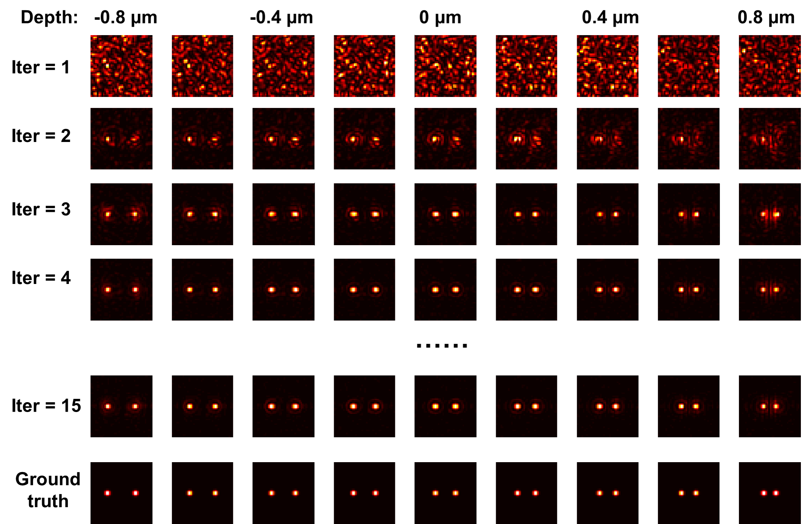
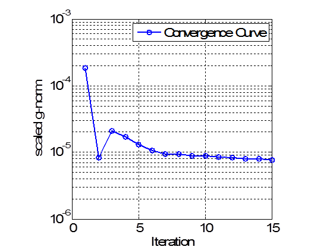
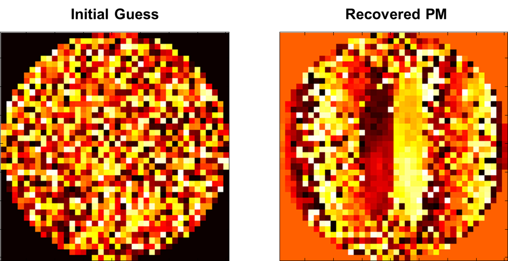

# Multiple-constrained-phase-retrieval
This repository contains a demonstration of the solution to multiple constrained phase retrieval problem. 

# Copyright
Copyright (c) 2018, Wenxiao Wang All rights reserved.

Redistribution and use in source and binary forms, with or without modification, 
are permitted provided that the following conditions are met:
   * Redistributions of source code must retain the above copyright
     notice, this list of conditions and the following disclaimer.
   * Redistributions in binary form must reproduce the above copyright
     notice, this list of conditions and the following disclaimer in
     the documentation and/or other materials provided with the distribution

By running: 
```
PM_design_stretching_PSF.m
```
the code will recover the phase mask that generates desired PSFs at differnt depth positions, which is essentially a multiple phase retrieval problem. 

# Recovering the phase mask within 15 iterations



# Results
- Convergence curve


- Recovered phase mask

